# Inkstream 🚀

## Description

Inkstream is a blog application that allows users to easily create, edit, and publish articles. It features a user-friendly interface, comment management, and design customization options for articles.

## Access the Application

You can access the deployed application by visiting: [https://inkstream.alwaysdata.net/](https://inkstream.alwaysdata.net/)

## Features

### For Users

- **Registration**  
  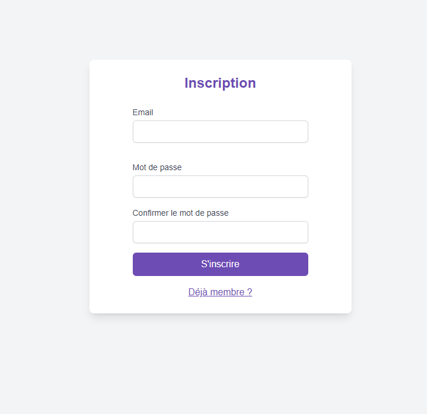
  
- **Login**  
  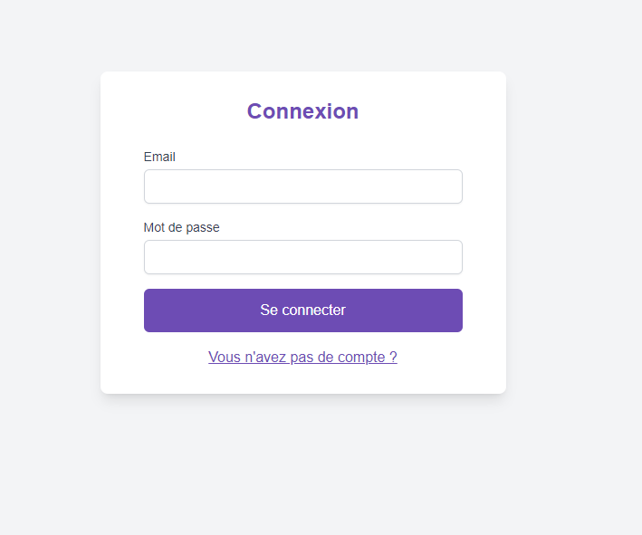
  
- **Send Email Confirmation for Registration**  
  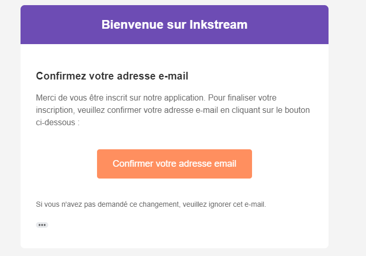
  
- **Modify Email**  
  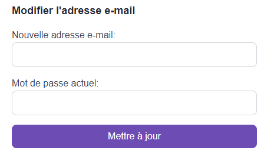
  
- **Send Email Confirmation for Email Update**  
  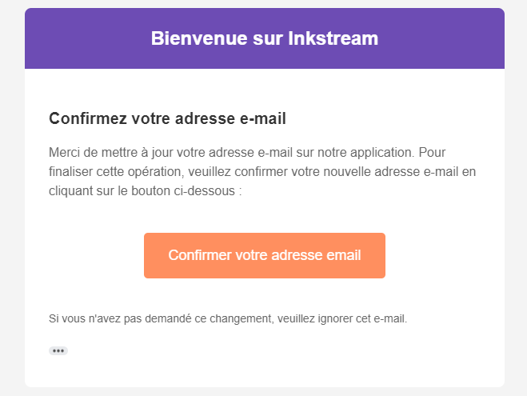
  
- **Add Avatar for User**  
  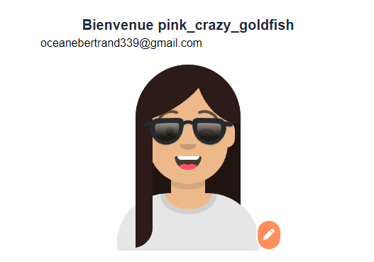

### For Articles

- **Write an Article and Use the Text Editor**  
  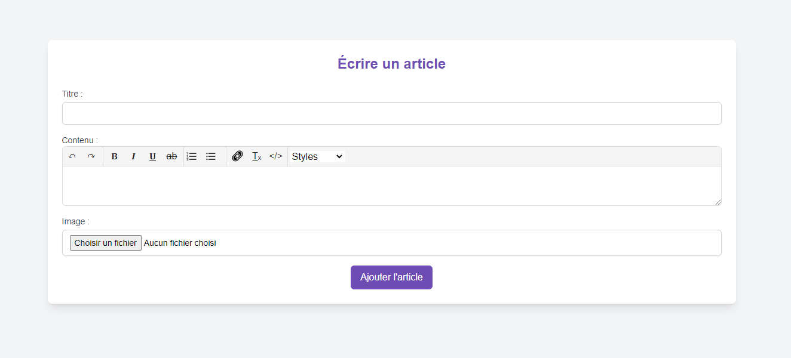
  
- **Article List**  
  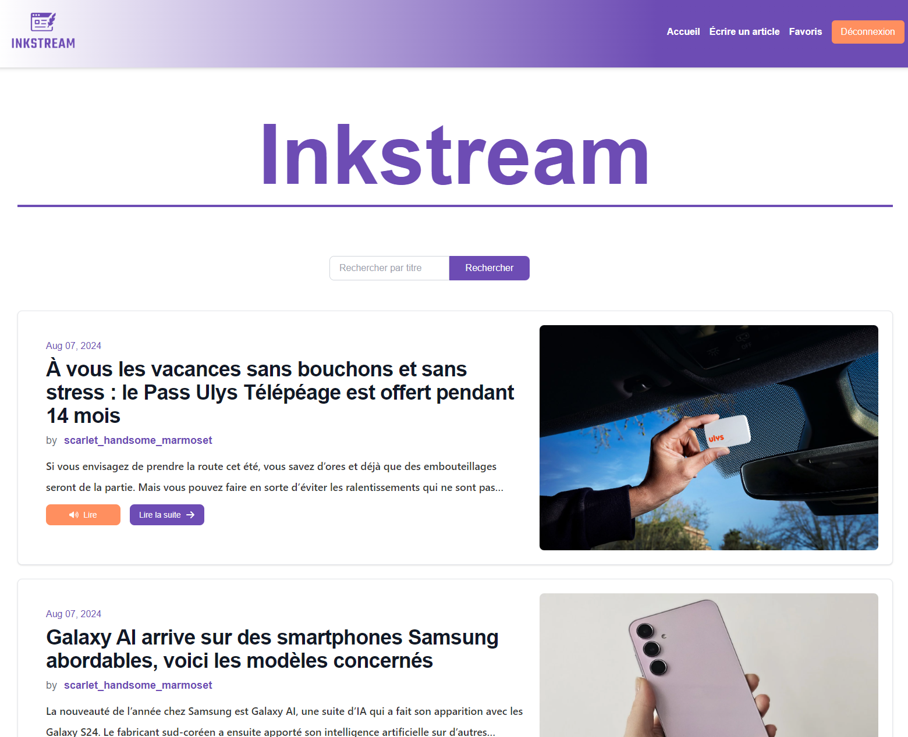
  
- **Search for an Article**  
  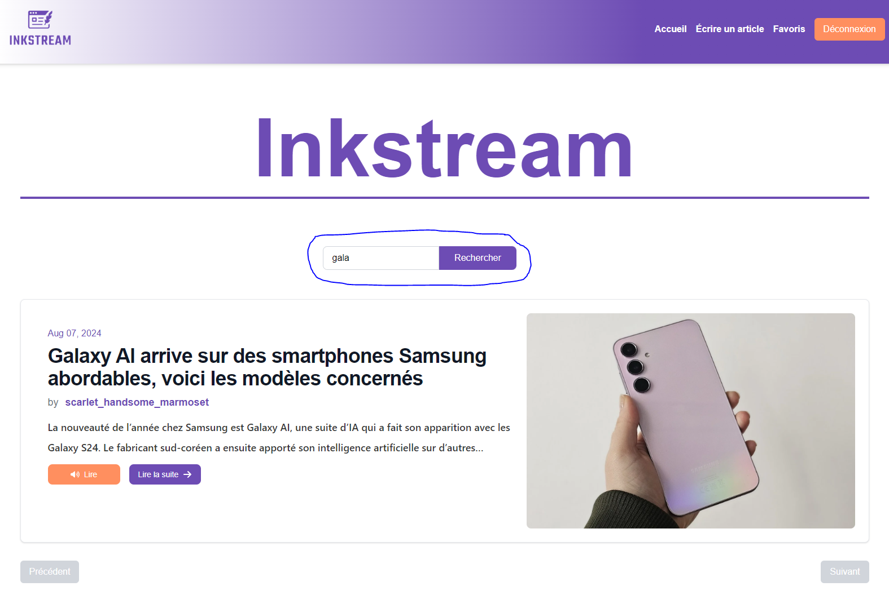
  
- **Listen to Article Audio**  
  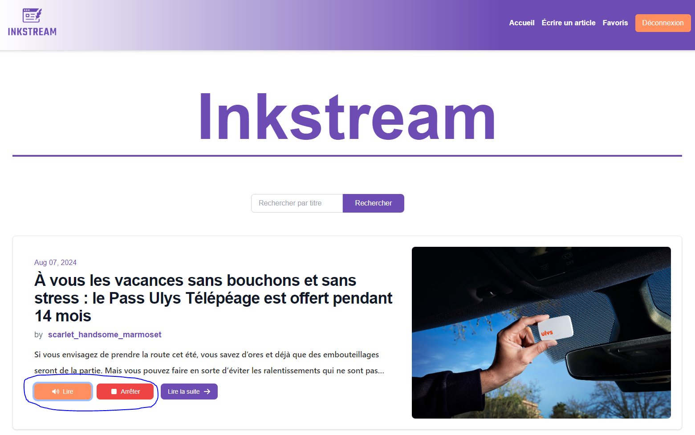
  
- **Read an Article**  
  
  
- **Edit or Delete an Article**  
  
  
- **Share an Article**  
  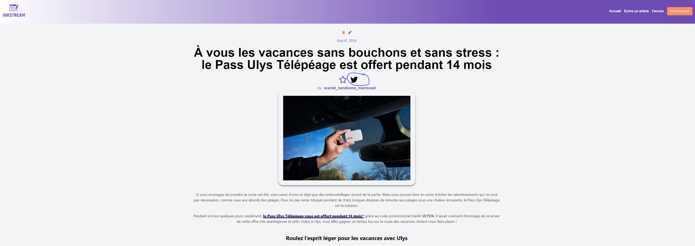
  
- **Favorite an Article**  
  
  
- **Listen to the Article**  
  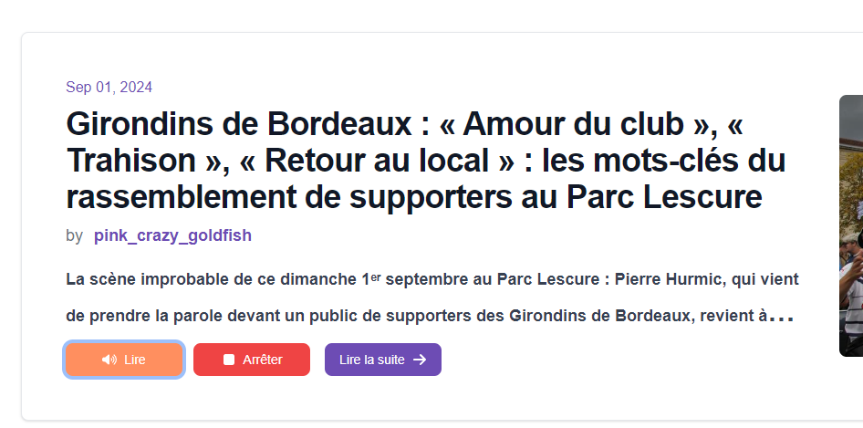

### For Comments

- **Add Comment or GIF**  
  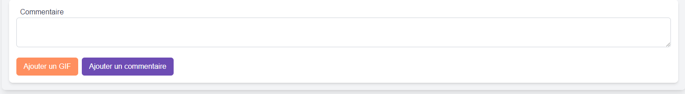
  
- **Comment List**  
  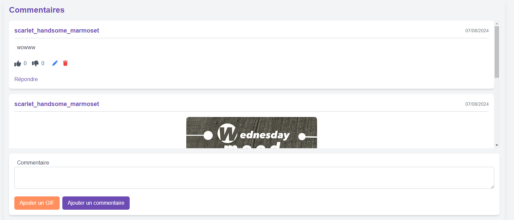
  
- **Edit or Delete Comment**  
  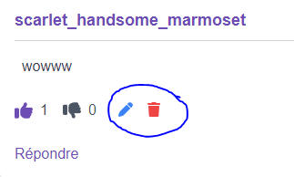
  
- **Comment Voting**  
  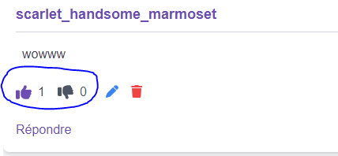
  
- **Comment Moderation**  
  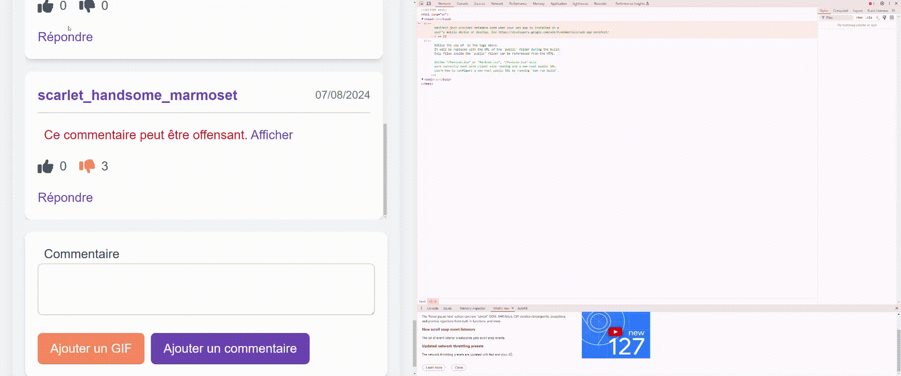
  
- **Reply to Comment**  
  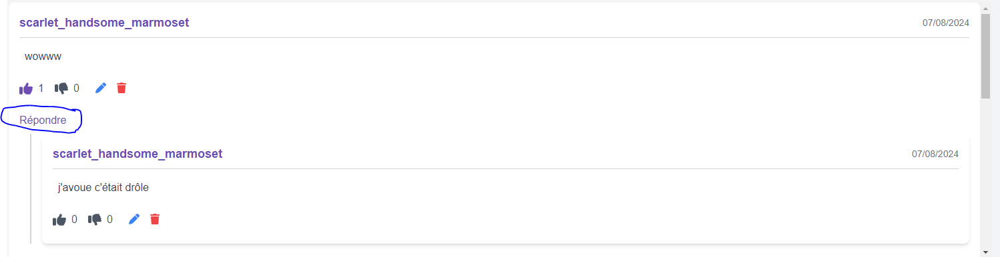
  
- **When Comment is Deleted**  
  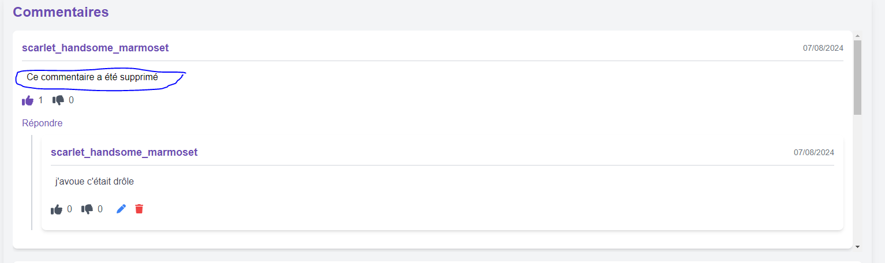

## Build

- **Frontend**: React
- **Style**: Tailwind CSS
- **Backend**: Node.js, Express.js, MongoDB.
- **Backend repostiory** : https://github.com/ocebert31/InkStream_API

## In Development

- To modify the password
- be able to find your password
- like the articles
- add infinite scroll
- add roles
- add categories to be able to filter articles
- add tags
- implement an IA API to be able to write articles automatically

## Environment Variables

```
REACT_APP_API_URL=http://localhost:3001
REACT_APP_GIPHY_API_KEY=api_key
REACT_APP_GIPHY_API_BASE_URL=https://api.giphy.com/v1/gifs/search
REACT_APP_URL=http://localhost:3000
```

## Installation
Clone the repository:
git clone repository_name

Navigate to the project directory:
cd inkstream

Install dependencies:
npm install

Start the application:
npm start

